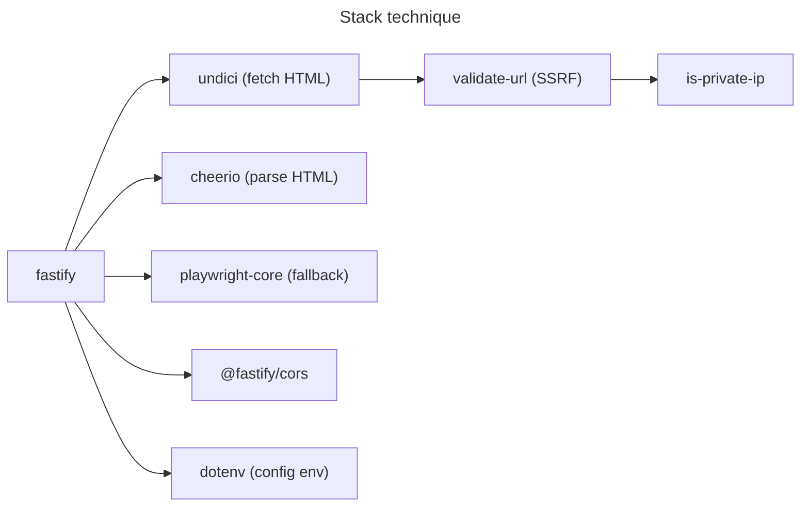
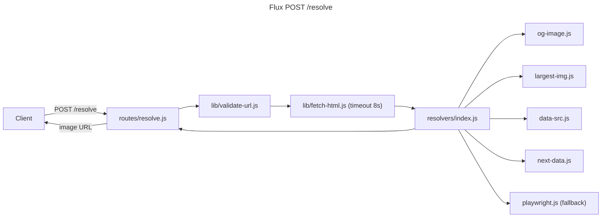

# Architecture

## Language/Framework

- **Runtime** : Node.js 18+
- **Framework HTTP** : Fastify (validation JSON intégrée via Ajv, ~2x plus rapide qu'Express)
- **Gestionnaire de paquets** : `pnpm`

## Packages applicatifs

| Rôle | Package |
| ---- | ------- |
| Framework HTTP | `fastify` |
| Fetch HTML | `undici` (inclus Node 18+) |
| Parse HTML | `cheerio` |
| Playwright fallback | `playwright-core` (optionnel, désactivable) |
| Validation SSRF | natif + `is-private-ip` |
| CORS | `@fastify/cors` |
| Config env | `dotenv` |

## Services communication

### POST /resolve — flux principal

### Naming Conventions

- **Files** : kebab-case (`fetch-html.js`, `validate-url.js`)
- **Functions** : camelCase
- **Variables** : camelCase
- **Constants** : UPPER_CASE
