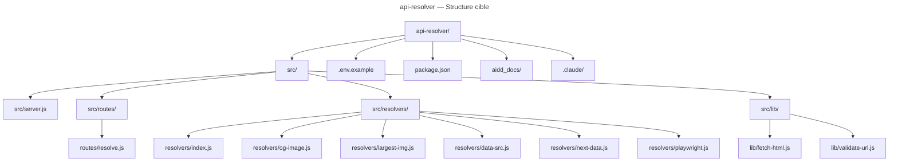

# Codebase Structure

## Fichiers clés

- `src/server.js` — bootstrap Fastify, enregistrement plugins et routes
- `src/routes/resolve.js` — handler `POST /resolve`, validation schéma Ajv
- `src/resolvers/index.js` — orchestrateur de la cascade (s'arrête au premier succès)
- `src/resolvers/og-image.js` — étape 1 : balise `og:image`
- `src/resolvers/largest-img.js` — étape 2 : plus grande `` dans le DOM
- `src/resolvers/data-src.js` — étape 3 : attribut `data-src`
- `src/resolvers/next-data.js` — étape 4 : blob `__NEXT_DATA__`
- `src/resolvers/playwright.js` — étape 5 (fallback) : rendu Playwright
- `src/lib/fetch-html.js` — fetch avec timeout global 8s via `undici`
- `src/lib/validate-url.js` — validation http/https + protection SSRF via `is-private-ip`

## Répertoires AIDD

- `.claude/agents/` — 5 agents IA spécialisés (alexia, claire, iris, kent, martin)
- `.claude/commands/` — 37 commandes slash organisées par phase SDLC (00–10)
- `.claude/rules/` — règles de code par catégorie (00–09)
- `aidd_docs/memory/` — memory bank du projet
- `aidd_docs/tasks/` — plans d'implémentation
